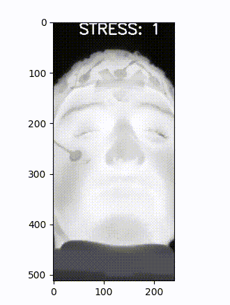

## StressVision
StressVision is a novel and fast system for detecting stress from thermal videos.
StressVision is the successor of [StressNet](https://github.com/UCSB-VRL/StressNet-Detecting-stress-from-thermal-videos),
another system designed for stress detection by the UCSB Vision Research Lab.

This repo maintains an implementation of all components of StressVision, using Python and the Pytorch deep learning framework.



This repository includes:
* Source code for Stress Detector
* Requirements file to setup the environment
* Training/Test code

[](https://www.python.org)
[](https://jupyterlab.readthedocs.io/en/stable)
[](https://pytorch.org)


If you use this research, please consider citing our paper.

## Citing

If this work is useful to you, please consider citing our paper:
```
@inproceedings{kumar2020stressnet,
  title={StressVision: Detecting Stress in Thermal Videos},
  author={Kumar, Satish and Iftekhar, ASM and Goebel, Michael and Bullock, Tom and MacLean, Mary H and Miller, Michael B and Santander, Tyler and Giesbrecht, Barry and Grafton, Scott T and Manjunath, BS},
  booktitle={Proceedings of the IEEE/CVF Winter Conference on Applications of Computer Vision},
  pages={999--1009}
}
```

### Requirements
- Linux or macOS with Python >= 3.9
- Pytorch >= 1.4.0
- CUDA 10.1 or 10.0 or 9.2
- cudNN (compatible with CUDA)

### Installation
1. Clone the repository
2. Install dependencies
```
pip install -r requirements.txt
```
